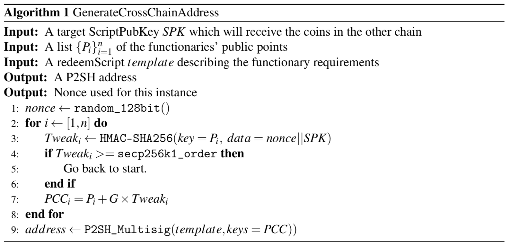

### 7 Acknowledgements 

We would like to thank Gavin Andresen, Corinne Dashjr, Mathias Dybvik, Daniel Folkinshteyn, Ian Grigg, Shaul Kfir, midnightmagic, Patrick Strateman, Kat Walsh, and Glenn Willen for reviewer comments.

#### Appendix A Federated Peg 

페그된 사이드 체인을 deploying 하는데 있어서 현재 큰 문제점 중 하나는 비트코인 스크립트가 현재 SPV 증명을 인코딩할만한 표현력이 부족합니다. The required expressiveness could be added in a safe, compatible, and highly compartmentalised way (e.g., by converting a no-op instruction into an OP_SIDECHAINPROOFVERIFY in a soft-fork). 그러나, 새로운 합의 알고리즘을 만드는 것, 심지어 간단한 새로운 기능을 배포하는 것 조차도 쉽지 않다. 이러한 어려움들을 recall 하는 것이 페그된 사이드 체인을 시작하는 주된 동기 중 하나였다. What we want is a way to try out future script capabilities for Bitcoin without deploying them everywhere.

다행히도, 몇가지 추가적인 security assumptions at the expense of the low trust design objective, 완벽한 비허가형 방법으로 initial deployment 하는 것이 가능해졌다. 지켜보아야 할 점이 있다. 비트코인 스크립트의 기능 향상은  The key observation is that any enhancement to Bitcoin Script can be implemented externally by having a trusted federation of mutually distrusting functionaries(13) evaluate the script and accept by signing for an ordinary multisignature script. Functionaries 들은 evaluating the same rules we would have wanted Bitcoin to evaluate 하여 protocol adaptor 로서 행동할 수 있지만 스크립트 enhancement 의 부족으로 할 수 없다.  

이 방법은 다중 서명 오프체인 거래 시스템을 구현하는 방법과 상당히 비슷하다, 하지만 필요한 서버간 합의 프로세스는 is provided by simply observing the blockchains in question. 결과는 결정론적이고, functionnary 들의 선택과 감독을 단순화시켜주는 고도의 감사 가능 기능을 가지고 있다. 이러한 유사성 때문에, 많은 기술들은 보안성을 높이고 and confidence in off-chain payment systems can be employed for federated pegs. 예를 들어 functionaries 는 지리적으로 퍼져있을 수 있고, 에스크로 된 코인에 bond 되어 있을 수도 있거나 expensive-to-create coercion-resistant pseudonymous identities, implemented on remote attesting tamper-resistant hardware, and so on[Tod13]. 더 작은 규모에서는, 해당 시스템에서 코인의 소유자들은 그들 스스로가 functionaries 로서 활동할 수 있다, 그럼으로써 제 3 기관의 신뢰를 회피할 수 있다. 

federated peg 를 사용하는 사이드 체인들이 사용되고 있으면, the addition of SPV verification to Bitcoin script can be seen as merely a security upgrade to reduce the trust required in the system. 현존하는 사이드체인에서는 단순히 그들의 코인을 새로운 검증 시스템으로 옮길 수 있다. 이는 추가적인 보안 옵션을 가능케한다 : 채굴에 의해 제공된 DMMS 의 경우에는 작은 시스템에서는 별로 안전하지 않다, 왜냐하면 규모가 큰 시스템이 더 위험하기 때문이다. 사이드 체인은 could adaptively use both of these approaches in parallel, or even switch based on apparent hashrate.

비트코인과 two-way 페깅을 하는데 있어서 3 of 5 federation of functionaries 를 사용하는 사이드 체인을 생각해보자. federation 에는 secp256k1 공개점(공개키) P1, P2, P3, P4, P5 가 있다. redeemscript template 3 x x x x x 5 OP_CHECKMULTISIG 은 사이드체인 내 모든 참가자들에게 알려져 있다. 코인을 ScriptPubKey SPK 에 보내려면, sidechain 에서 코인을 사용할 수 있게 하고 싶은 유저는 federation 페그를 사용하여 cross-chain P2SH 주소를 계산한다. 그 과정은 아래와 같다 : 

이 derivation scheme 은 BIP32 에서 사용된 homomorphic 기술과 같다. BIP 32 는 공개적으로 연결할 수 없는 주소를 제 3자가 파생할 수 있게 한 proposal 이다. pay-to-contract 거래와 같은 기반 construction 이다. 주소가 생성된 후에, 코인은 그곳에 지불될 수 있다. and the user can later receive the resulting coins on the sidechain by providing the functionaries with the nonce, ScriptPubKey, and an SPV proof to help them locate the payment in the blockchain. 사이드체인의 제 3자 검증을 지원하기 위해서 이 값들은 사이드체인 그 자체에 저장될 수 있다. 왜냐하면 거래는 표준 P2SH 주소에 지급함으로써 셍성되고 모든 ScriptPubKey 에 지불될 수 있다, 다중서명 주소에 지급할 수 있는 모든 비트코인 서비스는 will immediately be able to pay into, or receive payments from, a user using a federated sidechain.

Federated peg 는 신뢰 측면에서는 타협을 가해야 하지만, 비트코인을 바꿀 필요는 없다 - 참여자들이 이를 사용한다는 것에 동의를 하고 이를 사용함으로써 발생하는 비용과 위험성을 부담하면 된다. 그리고, 만약 특정 주체가 다른 사람들이 사이드체인 사용하는 것을 막고 싶다고 해도 막을 수 없다 : 만약 federated peg 가 폐쇄형 커뮤니티에서 사적으로 사용되게 된다면, 그 사용처는 추적 및 감사 불가능하다. 이러한 접근법은 급진한 개발과 실험을 가능케하고 and will allow the community to gain confidence in pegged sidechains before adopting any changes to the Bitcoin protocol.